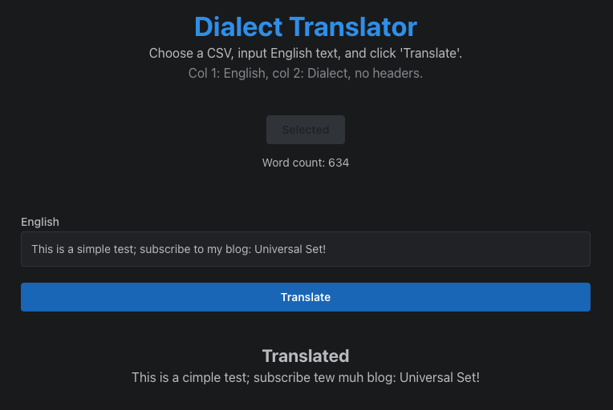

# Dialect Translator

This app takes a CSV file and converts text on a word-by-word basis.

## Approach

This was created in under 3 hours, so I had to take liberties. I used the technologies that I know best:

- Mantine: My favorite React components library
- Papaparse: CSV parsing package
- Vercel: deployment

## Usage

1. Clone this repo
2. Run `yarn` to install packages
3. Run `yarn dev` to start the development server

Your input CSV file must have two columns and _no headers_:

- **First**: Source words
- **Second**: Equivalent translated words

Example:
| | |
| --- | --- |
| afraid | afeared |
| cool | airish |

This app is also hosted at [https://dialect-translator.vercel.app/](https://dialect-translator.vercel.app/)

## ChatGPT Implementation

`src-chatgpt` includes code partially authored by ChatGPT in an attempt to recreate this app.

See my [Substack](https://universalset.substack.com/) for a reflection of the process.

## Substack

This repo was referenced on my Substack: [Universal Set](https://universalset.substack.com/)
